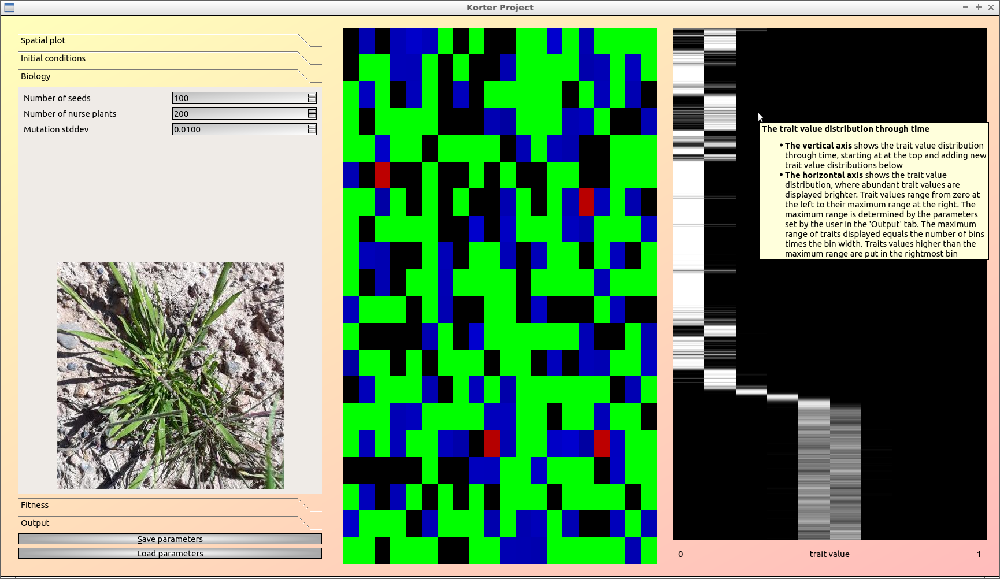
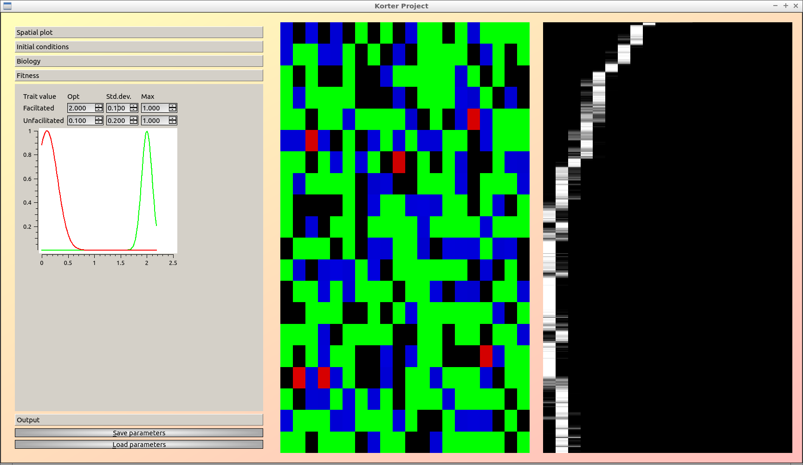
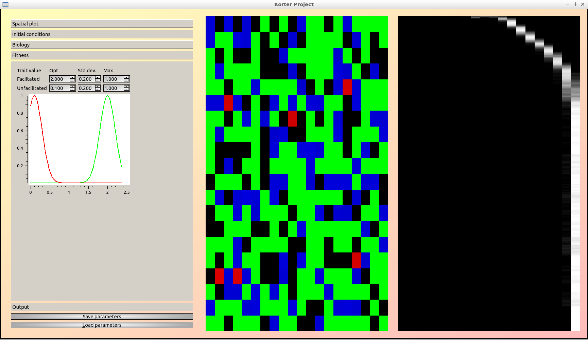
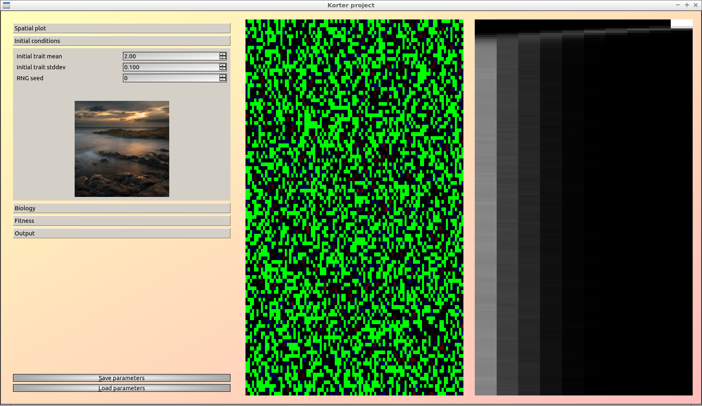
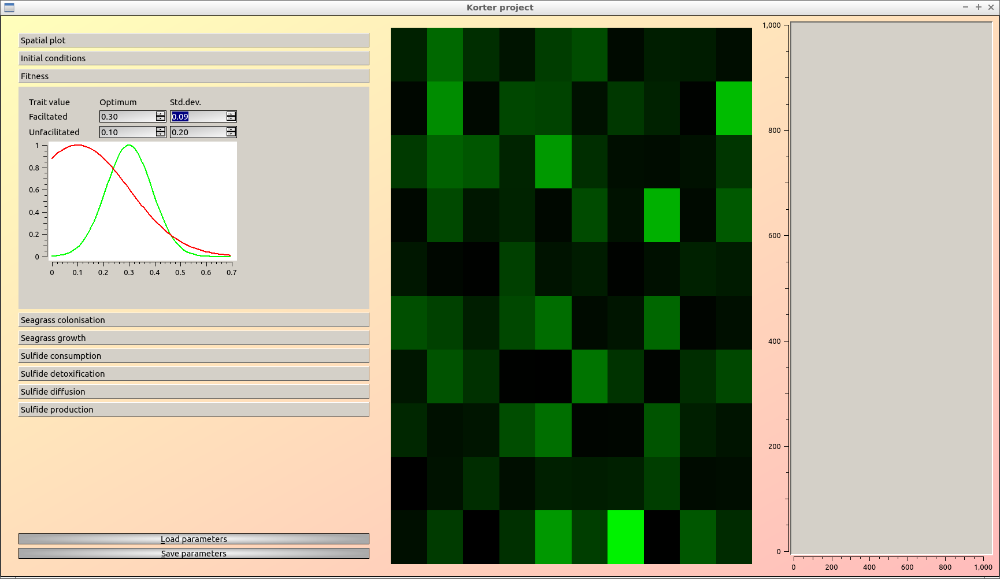

# korter_project

Branch||
---|---|---
master||
develop||

Research project for Megan Korte.

## Videos

 * v1.2: [YouTube](https://youtu.be/fjG0mtLOUBQ) [download (.ogv)](http://richelbilderbeek.nl/korter_project_1_2.ogv)
 * v1.0: [YouTube](https://youtu.be/5pkV3PY8uus) [download (.ogv)](http://richelbilderbeek.nl/korter_project_20190311.ogv)

## Downloads

 * [Windows executable (v1.2.1)](http://richelbilderbeek.nl/korter_project_1_2_1.zip)
 * [Windows executable (v1.2)](http://richelbilderbeek.nl/korter_project_1_2.zip)
 * [Windows executable (v1.1)](http://richelbilderbeek.nl/korter_project_1_1.zip)
 * [Windows executable (v1.0)](http://richelbilderbeek.nl/korter_project_desktop.zip)

## Why the name?

It started with [Jeroen Niemendal and Florian de Jagers's spatial model](https://github.com/JeroenN/Spatial-model).

Next came [Richel Bilderbeek's 'korte_project'](https://github.com/richelbilderbeek/korte_project),
but this was abandoned because QtCharts does not work on Travis CI yet.

## Older versions

